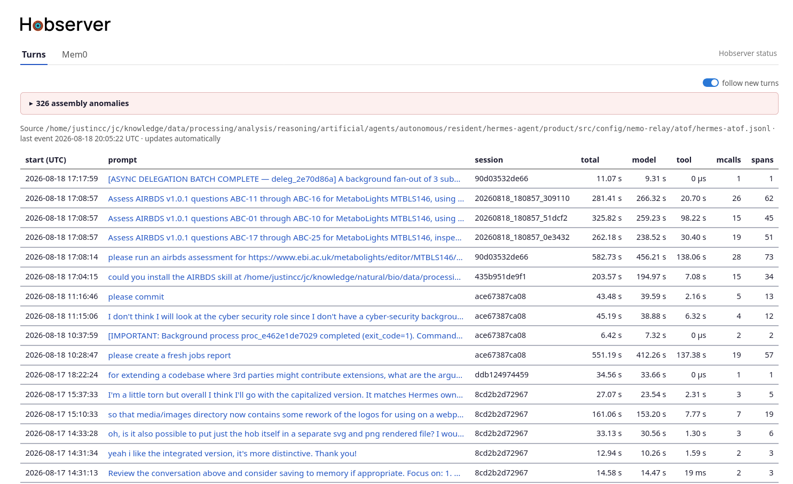

<picture>
  <source media="(prefers-color-scheme: dark)"
          srcset="static/hobserver-integrated-wordmark-capital-h-white.svg">
  
</picture>

Hobserver is a webapp for observing hermes-agent activity. The currently bundled plugins are:

- **Turns** — per-turn latency waterfalls from the NeMo Relay ATOF
  JSONL stream exported by the hermes-agent `observability/nemo_relay`
  plugin: where each turn's time went (model vs tool), with a
  span timeline per turn. This is a live stream that appears as the agent works.
- **Mem0** — browses `jmem0_logged.db`, the SQLite event log produced by
  justincc's hermes-agent mem0 logging wrapper.

## Screenshots

### Turns



The Turns view summarizes recent prompts and their total, model, and tool
durations, with links to detailed per-turn waterfalls.

## Philosophy

- **Be useful**. The primary purpose of Hobserver is to be a useful tool for seeing what Hermes
  is up to. So inferring information (e.g. which memory got changed on a memory operation)
  on top of what appears in logs and through API calls is a good thing to do. Or being able to click
  a link in the turns view and see the memory in full.
- **Be modular**. I started off making this because I was very curious about what Hermes
  was doing under the hood. But I have a particular way of using Hermes and a particular
  set of plugins that I use, where other people may end up invoking different tools or 
  be using different plugins. So an important value for the code is modularity. For example,
  it should be possible to write a plugin for any of the memory systems out there which can
  live in a separate git tree and doesn't need any modifications to the core Hobserver files.
- **Be opinionated**. I want to see important information at a glance, not look through a lot 
  of clutter. Therefore, Hobserver is purposefully opinionated about what it does and doesn't 
  display and where it does it.

## Security

**Hobserver has no authentication — run it only where only trusted parties can
reach it.** It binds loopback (`127.0.0.1`) by default; setting a non-loopback
`host` in `hobserver.toml` puts it on your network with nothing in front of it,
so do that only on a network you control. Log content is rendered safely
(HTML-escaped, no raw HTML), so pointing it at real logs is fine.

[SECURITY.md](SECURITY.md) has the full trust model.

## Running

Unless you already have [Herme's NeMo relay](https://docs.nvidia.com/nemo/relay/v0.5.0/nemo-relay-cli/hermes) configured you'll to set that up first to produce an [Agent Trajectory Observability Format (ATOF)](https://docs.nvidia.com/nemo/relay/configure-plugins/observability/atof) log that Hobserver can consume. See [docs/running/setup-prompt-timing.md](docs/running/setup-prompt-timing.md) for instructions.

By default, Hobserver will run with a default set of plugins configured, enough to observer Hermes if logs are in default locations. If you want to configure things any further, copy `hobserver.example.toml` to `hobserver.toml` and edit.

More details on Hobserver settings below.

Then run:

```bash
./hobserver [hobserver.toml]
```

`./hobserver` runs the app through uv, which builds the environment on first
use — so a fresh clone needs no setup step. It resolves its own location, so
you can run it from any directory.

If you don't give a `hobserver.toml` location then it will look for it in the current directory and drop back to built-in defaults if it doesn't find it.

The startup banner prints what each of those resolved to before it serves
anything, so first runs are worth reading.

## Configuration

Configuration is done in `hobserver.toml`. Here's a simplified example.

```toml
host = "127.0.0.1"

[[plugins]]
plugin = "plugins.turns"
settings = { atof_log = "$HERMES_HOME/nemo-relay/atof/hermes-atof.jsonl" }
settings = { index_db = "/var/tmp/hermes-atof-index.sqlite3" }

# Mem0 is opt-in — most installs don't produce a mem0 event log, so it isn't
# served by default. Add it like this when you do.
[[plugins]]
plugin = "plugins.memory.mem0"
# enabled = false          # one line to turn any tab off without removing it
```

`plugin` is any importable path, so a tab written elsewhere and installed
alongside is added the same way, with no fork of this repo — see
[docs/extending/writing-a-plugin.md](docs/extending/writing-a-plugin.md). The config file is taken
from the first command-line argument, else `$HOBSERVER_CONFIG`, else
`./hobserver.toml`.

Some important settings:

| tab | setting | default |
| --- | --- | --- |
| Turns | `atof_log` | `$HERMES_HOME/nemo-relay/atof/hermes-atof.jsonl` |
| Turns | `index_db` | `$XDG_CACHE_HOME/hobserver/atof-index-<hash>.sqlite3` |
| Mem0 | `db` | `$HERMES_HOME/jmem0_logged.db` |

`atof_log` is the events JSONL written by the nemo_relay plugin's ATOF
exporter.

`index_db` is a cache of the atof
log — the Turns tab does not hold a multi-gigabyte log in memory, it indexes
where each event sits and reads payloads back as pages need them
([ADR 11](docs/design/adr/0011-index-the-atof-log-rather-than-hold-it-in-memory.md)).

On startup the app prints how the settings were resolved.

## Status reporting

A **hobserver status** link sits at the right of the tab row on every page,
opening `/_status` in a new tab. This records fetches and other information for diagnostic purposes - successful HTTP calls won't appear on the console.

## Pages

Each tab is served under its own prefix — `plugins.<name>.URL_PREFIX`, which
is independent of the blueprint name the code uses, so a tab can be renamed
or moved without touching a single `url_for`. The mem0 tab is namespaced
under `memory/` because it is one memory system of several to come: another
provider, or hermes' own in-prompt stores, would be `/memory/<name>/`, and
`/memory/` itself is left free to become an index over them.

`/` redirects to the first tab (`/turns/`). Nothing else is served: a URL
that moves is not redirected from its old address. This is a single-user
tool, and carrying compatibility routes for one reader costs more in reading
than it saves in typing — expect a page open across a rename to 404 until it
is reloaded.

### Mem0 tab

- `/memory/mem0/` — all mem0 events, newest first, with a truncated query;
  click an id or query to open the event. The page tails the log: it polls
  `/memory/mem0/fragment/events?since=<last id>` every 3 seconds and prepends
  any new rows to the top of the table.
- `/memory/mem0/fragment/events?since=<id>` — rendered table rows for events
  newer than `<id>`, newest first (used by the index poll).
- `/memory/mem0/event/<id>` — one event, described below.
- `/memory/mem0/search-event?session=<id>&query=<q>[&ts=<µs>]` — redirects to
  the event page for one `mem0_search` call. This is the handoff from a
  mem0_search span in the Turns tab; see
  [docs/design/span-rendering.md](docs/design/span-rendering.md) for how the two logs are
  matched, and why it is a redirect rather than a lookup.

The event page opens with a metadata block (every field except query and
result), then the query, the result and the context messages as plaintext.

- The query heading is named for what the column actually holds on that event
  type: "Query" on a `prefetch` or `mem0_search`, "Added text" on a
  `mem0_add`, "New text" on a `mem0_update`, "Deleted memory id" on a
  `mem0_delete`.
- An update or delete also gets a "Previous text" section — what the memory
  said before the change, recovered from this app's own event log, with the
  search event it came from and how long before.
- Results that are JSON (e.g. `mem0_search` output) are pretty-printed; others
  (e.g. prefetch markdown) are shown as-is.
- Context messages are the up to 10 preceding prefetch queries logged for the
  same session, each prefixed with its event id, oldest first. Tool-call
  events are excluded — they are not user messages. It approximates the extra
  conversational context mem0 uses during retrieval.

### Turns tab

- `/turns/` — all turns, newest first, one line each: start time, the prompt
  (from the turn-start mark's `user_message`; em dash when absent — it fills the
  leftover width and ellipsizes, so nothing else is abbreviated), the session
  (the leading segment of the turn id, which hermes builds as
  `{session}:{task}:{hash}` — the full id is on the turn page), total / model /
  tool durations, and model-call and span counts. In-flight turns are marked. Parse errors and assembly anomalies are
  shown above the table, folded closed and on this page only — never dropped.
  Updates itself every 3 s.
- `/turns/turn/<session>/<start_us>` — one turn, described below.
- `/turns/span/<span uuid>/<key>` — one whole value of one span, on a page
  of its own: a model call's `request` (every message it was sent, system
  prompt included, one labelled box per message) or its `response`, rendered
  as markdown, with `?raw=1` for the characters underneath. Every label and
  heading the app writes is boxed chrome; anything inside a box went on the
  wire. Reached by the open-in-a-new-tab icon at the end
  of an excerpt, never navigated to by hand — so it carries no tab bar, just
  a nav row back to the turn the span ran in and to the raw text. Which values
  a scope offers is declared with it — see
  [ADR 12](docs/design/adr/0012-open-a-whole-value-on-its-own-page.md).

The turn page runs top to bottom:

1. The nav row — "all turns", then muted « prev / next » stepping one turn
   older / newer through the same interleaved-by-start-time ordering the turn
   list uses, so they cross session boundaries just as it does. Each is titled
   with the neighbour's prompt, and greys out at either end.
2. The in-flight strip.
3. The turn id / session / started heading; a muted icon beside the turn id
   copies it to the clipboard.
4. The prompt — whole when short, collapsed to its first couple of lines with
   the full text a click away when long.
5. Summary stats.
6. The span waterfall: model blue, tool orange, other violet, open spans faded,
   with offsets and durations as text.

The turn's non-boundary marks (approvals, session end) are instantaneous, so
they interleave with the spans as rows whose bar is a zero-width tick at their
offset, clamped to the track — session end fires just after the turn-end mark.

Each span row also shows what the call was *for*, drawn from its payload and
rendered per tool scope: the command a terminal call ran, the path a file tool
touched, a mem0_search's top hits, and so on. That is a subject of its own —
see [docs/design/span-rendering.md](docs/design/span-rendering.md).

Where a row can only show an excerpt — what a model was asked, what it said —
a small icon at the end of it opens the whole thing in a new tab. That works
for every model call, including hermes' own background ones: a context
compaction's instruction and summary are readable there and nowhere else on
the site.

While the turn is in flight the page updates itself every 2 s; once it ends
the page is static.

### Live updating

Timing pages self-update by polling and swapping, show an in-flight strip, and
offer a follow-mode toggle, on by default, that opens new turns as they start.
Because hermes
drops `hermes.turn.end` marks often, an open turn is poor evidence of running
work, and liveness is decided by proof rather than by a clock.

See [docs/design/live-pages.md](docs/design/live-pages.md) for all of it.


## Tests

```bash
uv run pytest                      # both roots: tests/ and every plugins/<name>/tests/
uv run pytest plugins/memory/mem0  # one plugin's alone
```

## Layout

- `app.py` — app shell: app factory `create_app(tabs)`, tab registration, the
  tab bar, the root redirect, CLI entry. Imports no plugin.
- `tabs.py` — reads `hobserver.toml` and loads the modules it names; the
  collision check and the per-tab failure handling live here
- `hobserver.example.toml` — the tracked config template, copied to a
  gitignored `hobserver.toml` to customise; built-in defaults serve without one
- `hermes_paths.py` — where hermes-agent keeps things, for the in-tree
  plugins' default paths
- `scope_spec.py` — the scope-spec vocabulary (ADR 7): the row descriptors
  (`Field`, `Row`, `Scope`, …) and their resolver, imported by any plugin that
  paints spans. A shared surface owned by no tab and never touched by the shell
  (which does not know what a scope spec is); it depends on nothing in the app.
- `providers.py` — the provider vocabulary (ADR 13): the token-count shapes and
  per-provider payload reading, imported by any plugin adding a `provider_spec`.
  Shared the same way as `scope_spec.py`. Both moved out of `plugins/turns/` so
  a span- or provider-contributing plugin depends on a neutral module, not on
  the Turns tab's package (ADR 21).
- `plugins/` — one package per in-tree view, each self-contained: its module
  attributes (`PLUGIN_API`, the Flask blueprint `bp` registered under
  `/<URL_PREFIX>/`, `TAB_LABEL`, `URL_PREFIX`, optional `init_app` and
  `sources`), its own `templates/<name>/`, and a `scopes.py` where it
  describes how its own spans render elsewhere (ADR 10). A plugin is one
  directory, so lifting it into an installed package takes all of it. See [docs/extending/writing-a-plugin.md](docs/extending/writing-a-plugin.md) for the
  contract, [docs/extending/plugins-and-urls.md](docs/extending/plugins-and-urls.md) for how
  plugins reach each other (by link or published accessor, never by opening
  another's data source — ADR 4).
- `plugins/turns/` — a package holding the full ATOF reader (ADR 2):
  `tailer.py` (incremental read), `atof_reader.py` (JSONL line → typed event,
  fail-soft) and `assembler.py` (events → sessions → turns → waterfall). See
  [docs/design/atof-reader.md](docs/design/atof-reader.md).
- `templates/` — only what the shell owns and every tab shares: `base.html`
  (chrome, tab bar, the CSS classes plugins render against), `_item_nav.html`
  (the `item_nav` macro every detail page uses), and `unavailable.html` for a
  tab that could not load. Each plugin's own pages live with the plugin.
- `static/` — the shell's brand assets, served by Flask at `/static/`: the
  wordmark shown in the masthead and the hob icon used as the SVG favicon
  (both referenced from `base.html`). The README's own header pairs the black
  wordmark with a white variant through `<picture>`, so it stays legible on
  GitHub's light and dark themes.
- `conftest.py` — fixtures every test can reach, and `REPO_ROOT` for the
  ones that read a file out of the tree
- `tests/` — the shell's own: `test_app.py`, `test_tabs.py`,
  `test_request_log.py`. A plugin's tests live with the plugin, in
  `plugins/<name>/tests/`, and `uv run pytest` collects both roots
- `docs/` — split by who reads it:
  - [`design/`](docs/design/) — why the app is shaped as it is, for anyone
    changing it: [design-principles.md](docs/design/design-principles.md),
    [`adr/`](docs/design/adr/), [atof-reader.md](docs/design/atof-reader.md),
    [span-rendering.md](docs/design/span-rendering.md),
    [live-pages.md](docs/design/live-pages.md)
  - [`extending/`](docs/extending/) — writing against it from outside:
    [writing-a-plugin.md](docs/extending/writing-a-plugin.md),
    [writing-a-scope-spec.md](docs/extending/writing-a-scope-spec.md),
    [plugins-and-urls.md](docs/extending/plugins-and-urls.md)
  - [`running/`](docs/running/) — operating it:
    [setup-prompt-timing.md](docs/running/setup-prompt-timing.md),
    [startup-and-console.md](docs/running/startup-and-console.md)

## License

MIT — see [LICENSE](LICENSE). Copyright (c) 2026 Justin Clark-Casey.
