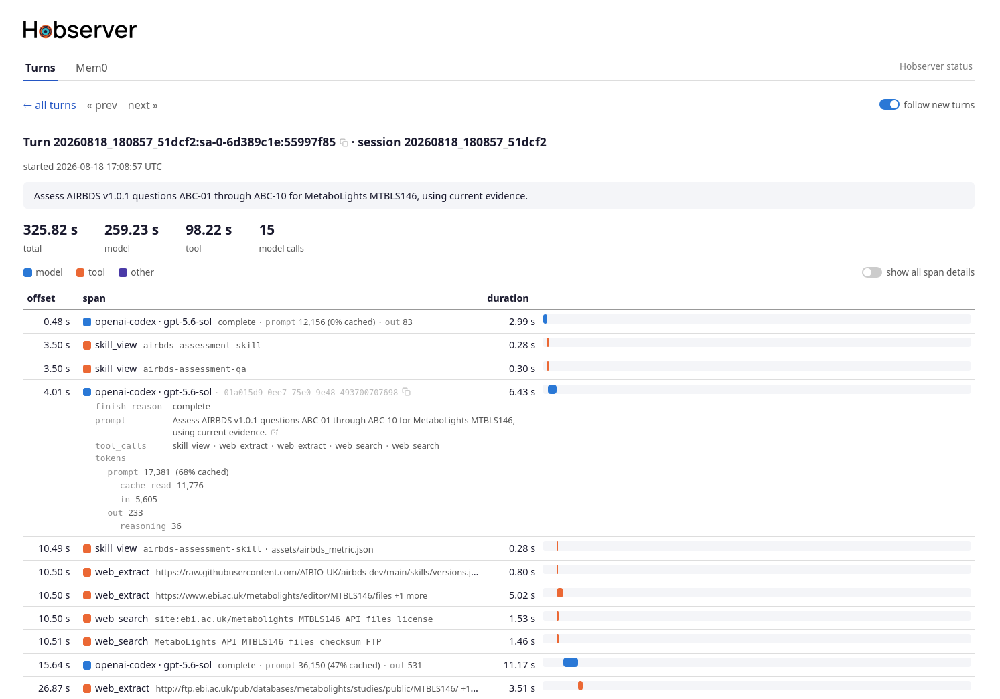
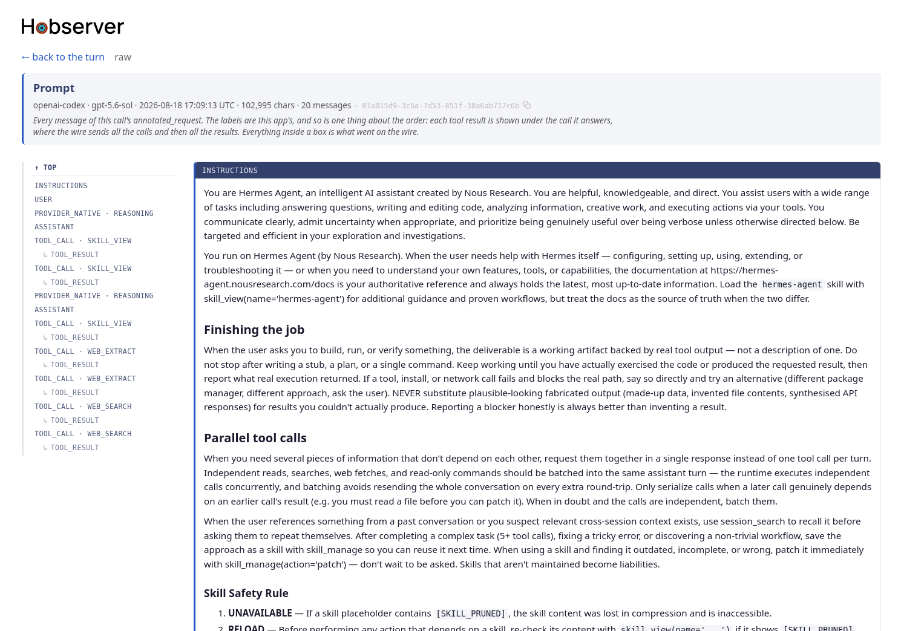

<picture>
  <source media="(prefers-color-scheme: dark)"
          srcset="static/hobserver-integrated-wordmark-capital-h-white.svg">
  
</picture>

Hobserver is a webapp for observing live and recent sesssion-oriented [Hermes Agent](https://github.com/NousResearch/hermes-agent)
activity. The currently bundled plugins are:

- **Turns** — the main plugin. Live and recent per-session turn waterfalls from the NVIDIA NeMo Relay ATOF
  JSONL stream that Hermes Agent's NeMo Relay integration exports.
  - Live stream that appears as the agent works.
  - Shows where where each turn's time went (model vs tool) with a span timeline. 
  - Shows relevant details for each model or tool call (e.g. how many cached tokens were used on a model call, the script a model ran when invoking the terminal tool, the web searches and extractions it carries out).
  - Link to show full details of a model call, including system prompt and tool call results.
  - Link from a skill call to view the skill itself — its SKILL.md and files — read from the configured skill roots.
  
- **Mem0** — browses `jmem0_logged.db`, the SQLite database that
  [jmem0-logged](https://github.com/justincc/jmem0-logged), a hermes-agent
  plugin, populates with Mem0 events triggered by Hermes.
  - Shows all Hermes Mem0 operations, such as what memories were fetched during the prefetch part of the session turn.

Pull requests for additional plugins are very welcome - I want to take a "batteries -included" approach wherever reasonable.

## Project Philosophy

I'm very curious as to what Hermes is doing under the hood. What prompts is it sending in model requests? What memories is it recalling and making? What tools is it calling? What skills does it use?

I looked around but didn't find anything obviously met my needs. There are some great observability tools out there (e.g. Langfuse) but they're built for general agent observability. I wanted something closely fitted to Hermes, so that I can see the most relevant Hermes detail at a glance without any other clutter. And of course, it's fun to build your own :D.

Below are the project principles. Pull requests in tune with these are very welcome. Hobserver starts out as my tool but I want to make it also useful to others who are looking for the same kind of information.

- **Be useful**. The primary purpose of Hobserver is to be a useful tool for seeing what Hermes
  is up to. So inferring information (e.g. which memory got changed on a memory operation)
  on top of what appears in logs and through API calls is a good thing to do. Or being able to click
  a link in the turns view and see the memory in full.
- **Be opinionated**. At the same time I want to see important information at a glance, not look through a lot 
  of clutter. Therefore, Hobserver is purposefully opinionated about what it does and doesn't display and where and how it does it. I hope people share my taste in relevant information but pull requests to include extra fields or tool calls not covered are very welcome.
- **Be pragmatic**. An example. Rather than hook into Hermes events like Langfuse, for its main Turns tab Hobserver currently reads the NeMo ATOF log that Hermes Agent's NeMo Relay integration produces. This has the pro of simplicity (no need to store events) and the con of poor scalability (ATOF logs grow very large). As Hobserver was built for looking at live and recent activity this seems a pragmatic choice. But if compelling usecases come along for longer-term storage this decision can be revisited.
- **Be modular**. I started off making this because I was very curious about what Hermes
  was doing under the hood. But I have a particular way of using Hermes and a particular
  set of plugins that I use, where other people may end up invoking different tools or 
  be using different plugins. So an important value for the code is modularity. For example,
  it should be possible to write a plugin for any of the memory systems out there which can
  live in a separate git tree and doesn't need any modifications to the core Hobserver files.


## Security

**Hobserver has no authentication — run it only where only trusted parties can
reach it.** It binds loopback (`127.0.0.1`) by default; setting a non-loopback
`host` in `hobserver.toml` puts it on your network with nothing in front of it,
so do that only on a network you control. Log content is rendered safely
(HTML-escaped, no raw HTML), so pointing it at real logs is fine.

If usecases comes up where authentication is necessary then very happy to look at adding this.

[SECURITY.md](SECURITY.md) has the full trust model.

## Running

Unless you already have [Herme's NeMo relay](https://docs.nvidia.com/nemo/relay/v0.5.0/nemo-relay-cli/hermes) configured you'll to set that up first to produce an [Agent Trajectory Observability Format (ATOF)](https://docs.nvidia.com/nemo/relay/configure-plugins/observability/atof) log that Hobserver can consume. See [docs/running/setup-prompt-timing.md](docs/running/setup-prompt-timing.md) for instructions.

By default, Hobserver will run with a default set of plugins configured, enough to observer Hermes if logs are in default locations. If you want to configure things any further, copy `hobserver.example.toml` to `hobserver.toml` and edit.

More details on Hobserver settings below.

Then run:

```bash
./hobserver [hobserver.toml]
```

`./hobserver` runs the app through uv, which builds the environment on first
use — so a fresh clone needs no setup step. It resolves its own location, so
you can run it from any directory.

If you don't give a `hobserver.toml` location then it will look for it in the current directory and drop back to built-in defaults if it doesn't find it.

The startup banner prints what each of those resolved to before it serves
anything, so first runs are worth reading.

## Configuration

Configuration is done in `hobserver.toml`. Here's a simplified example.

```toml
host = "127.0.0.1"

[[plugins]]
plugin = "plugins.turns"
settings = { atof_log = "$HERMES_HOME/nemo-relay/atof/hermes-atof.jsonl" }
settings = { index_db = "/var/tmp/hermes-atof-index.sqlite3" }

# Mem0 is opt-in — most installs don't record mem0 events, so it isn't
# served by default. Add it like this when you do.
[[plugins]]
plugin = "plugins.memory.mem0"
# enabled = false          # one line to turn any tab off without removing it
```

`plugin` is any importable path, so a tab written elsewhere and installed
alongside is added the same way, with no fork of this repo — see
[docs/extending/writing-a-plugin.md](docs/extending/writing-a-plugin.md). The config file is taken
from the first command-line argument, else `$HOBSERVER_CONFIG`, else
`./hobserver.toml`.

Some important settings:

| tab | setting | default |
| --- | --- | --- |
| Turns | `atof_log` | `$HERMES_HOME/nemo-relay/atof/hermes-atof.jsonl` |
| Turns | `index_db` | `$XDG_CACHE_HOME/hobserver/atof-index-<hash>.sqlite3` |
| Mem0 | `db` | `$HERMES_HOME/jmem0_logged.db` |

`atof_log` is the events JSONL written by Hermes Agent's NeMo Relay ATOF
exporter.

`index_db` is a cache of the atof
log — the Turns tab does not hold a multi-gigabyte log in memory, it indexes
where each event sits and reads payloads back as pages need them
([ADR 11](docs/design/adr/0011-index-the-atof-log-rather-than-hold-it-in-memory.md)).

On startup the app prints how the settings were resolved.

## Status reporting

A **hobserver status** link sits at the right of the tab row on every page,
opening `/_status` in a new tab. This records fetches and other information for diagnostic purposes - successful HTTP calls won't appear on the console.

## Tests

```bash
uv run pytest                      # both roots: tests/ and every plugins/<name>/tests/
uv run pytest plugins/memory/mem0  # one plugin's alone
```

## Screenshots


The Turns overview summarizes recent prompts and their total, model, and tool
durations, with links to detailed per-turn waterfalls.



The turn detail view shows where an individual turn spent its time. Summary
statistics separate model and tool latency, while the waterfall places every
model call, tool call, and other span on a shared timeline. Expandable span
details expose prompts, token usage, tool inputs, and other diagnostic context.



The full model span view opens an entire model request without truncation. Its
message index makes instructions, user and assistant messages, tool calls, and
tool results directly navigable in wire order, while the header records the
provider, model, timestamp, request size, message count, and span identifier.
The exact underlying content is also available through the raw view.

## Documentation

Each bundled plugin has a README describing its own pages:

- [plugins/turns/README.md](plugins/turns/README.md) — the Turns tab
- [plugins/memory/mem0/README.md](plugins/memory/mem0/README.md) — the Mem0 tab

Other than that, `docs/` is the main documentation directory. It's organized by role:

- [`running/`](docs/running/) — for operators of Hobserver:
  - [setup-prompt-timing.md](docs/running/setup-prompt-timing.md) — producer-side setup in hermes-agent, so there is an ATOF log to read at all.
  - [startup-and-console.md](docs/running/startup-and-console.md) — source resolution, the db check, the startup banner, console noise and `/_status`.
- [`extending/`](docs/extending/) — for plugin writers:
  - [writing-a-plugin.md](docs/extending/writing-a-plugin.md) — the main extension document: how to add a tab, with a whole worked plugin and the contract in full.
  - [writing-a-scope-spec.md](docs/extending/writing-a-scope-spec.md) — make the Turns tab display your own hermes tool and read its payload.
  - [writing-a-provider-spec.md](docs/extending/writing-a-provider-spec.md) — make the Turns tab read your own router's token counts.
  - [plugins-and-urls.md](docs/extending/plugins-and-urls.md) — the plugin contract, the config file, what happens when a tab can't load, URL naming and crossing between plugins.
- [`design/`](docs/design/) — documents for engineers. To be honest, I accidentally let Opus 5 get its hook into these so they may need clean up and removal of obtuse and redundant parts :D.
  - [design-principles.md](docs/design/design-principles.md) — the standing commitments the app is built on.
  - [atof-reader.md](docs/design/atof-reader.md) — how the ATOF log is read: line reader → parser → index → assembler, and the span readings beside them.
  - [span-rendering.md](docs/design/span-rendering.md) — what each tool scope shows on the turn page, scope by scope.
  - [live-pages.md](docs/design/live-pages.md) — polling, liveness, follow mode, item navigation and waterfall colours.
  - [`adr/`](docs/design/adr/). Architectural Decision Records. Almost entirely AI written. An experiment to see if ADRs are helpful for AI-driven engineering. I suspect maybe not since all the ADRs on early decisions that have now been entirely superseded. This may just end up polluting context.

## License

MIT — see [LICENSE](LICENSE). Copyright (c) 2026 Justin Clark-Casey.
